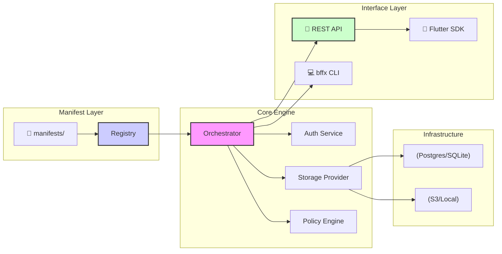

# BFFX — manifest-driven Go backends for mobile apps

[](https://github.com/hangry-coder/bffx/releases)
[](https://goreportcard.com/report/github.com/hangry-coder/bffx)
[](https://github.com/hangry-coder/bffx/blob/main/LICENSE)

**BFFX is a manifest-driven Go backend generator for indie developers and small teams shipping mobile apps** (Flutter-first workflows, with a plain REST API for anything else). You declare resources, policies, screens, and hooks in YAML; the compiler and orchestrator turn that into routing, auth-aware CRUD, and extension points without boilerplate drift. Not sure if BFFX is right for you? Read **[State of the Project](docs/getting-started/state_of_the_project.md)** (capabilities, limitations, decision guide).


Honest status (see **[`docs/status_matrix.md`](docs/status_matrix.md)** and **[state of the project](docs/getting-started/state_of_the_project.md)**):

| Area | Status | Notes |
|------|--------|--------|
| CRUD + JWT auth + policies | Stable | Core path; strong test focus |
| Screens / builders / feature flags | Beta | Used in pilots; still evolving |
| Push (FCM), email, blob presign | Beta | Env-wired; check ops docs |
| Mongo / PocketBase `Store` drivers | Experimental | Build with `-tags=experimental_mongo` / `experimental_pocketbase` only |
| Worker (Python), deploy, some admin UX | In progress | See matrix and [limitations](docs/getting-started/state_of_the_project.md#2-known-limitations--architectural-guardrails) |

---

## Why BFFX?

Traditional backends repeat the same work: models, CRUD, auth, and keeping docs in sync. **BFFX centralizes the contract in `bffx/` manifests** and generates the boring glue so you keep logic in small Go hooks.

| Concern | Typical Go service | BFFX |
|---------|---------------------|------|
| Boilerplate | Large hand-written layers | Manifest-driven routing + validation |
| Auth | DIY middleware stacks | Built-in JWT, refresh rotation, guest/anonymous flows |
| Mobile pairing | Ad hoc OpenAPI | Compiler graph + client generation path (see [`docs/mobile/flutter.md`](docs/mobile/flutter.md)) |
| Agents / tooling | N/A | [MCP](https://modelcontextprotocol.io) control plane for safe inspection |

---

## 🏗 Architecture



---

## Repository map

| Path | Purpose |
|------|---------|
| [`pkg/`](pkg/) | Storage, router, auth, compiler, integrations |
| [`cmd/bffx/`](cmd/bffx/) | `bffx` CLI (`new`, `sync`, `dev`, `migrate`, …) |
| [`docs/`](docs/) | Architecture, auth, operations, [architecture contracts](docs/core-concepts/architecture_contracts.md), [build profile](docs/core-concepts/build_profile_contract.md) |
| [`docs/extending/custom_routes.md`](docs/extending/custom_routes.md) | **Custom Routes Cookbook** (register custom http routes) |
| [`docs/mobile/rest_only.md`](docs/mobile/rest_only.md) | **REST-Only Mobile Guide** (bypass server-driven UI) |
| [`docs/integrations/`](docs/integrations/README.md) | Honest vendor notes (Supabase, Firebase, PostHog, …) |
| [`docs/contributing/test_coverage.md`](docs/contributing/test_coverage.md) | PR coverage gate floors |
| [`examples/notes/`](examples/notes/README.md) | **End-to-end reference app** (auth, CRUD, screen, hooks, ShareNote) |
| [`examples/pipelines-calorie/`](examples/pipelines-calorie/README.md) | **AI ingestion pipeline** (catalog addon, no nutrition battery) |
| [`intel/`](intel/) | `active_tasks.md` + `history.md` — assistant handoff (`#cursor` / `#ag` / `#human`) |
| [`CHANGELOG.md`](CHANGELOG.md) | Release notes |

---

## 📦 Supported packages

BFFX exposes a highly decoupled set of packages in `pkg/` designed to be easily reused or extended:

| Package | Purpose | Production Readiness | Description |
|---------|---------|----------------------|-------------|
| [`pkg/api/router`](pkg/api/router/) | HTTP Router & Middleware | **Production** | Core HTTP pipeline, JWT auth routing, and automated request lifecycle. |
| [`pkg/storage`](pkg/storage/) | Unified Storage & SQL Engine | **Production** | Abstract CRUD store, transaction safety, and schema management. |
| [`pkg/auth`](pkg/auth/) | Security & Identity Engine | **Production** | JWT token generation, guest sessions, and cryptographic key management. |
| [`pkg/manifest`](pkg/manifest/) | Spec Parsing & Schema | **Production** | YAML loading, resource specification parsing, and validation. |
| [`pkg/buildprofile`](pkg/buildprofile/) | Build Profile & Packaging | **Beta** | Derives `.bffx/build-profile.json`; full/minimal vendoring and migration helpers. |
| [`pkg/api/handlers`](pkg/api/handlers/) | Resource REST Handlers | **Production** | CRUD action controllers and SDUI payload builders. |
| [`pkg/batteries`](pkg/batteries/) | Extensible Plugin System | **Beta** | Connectors for caching, notifications, and mail services. |

---

## Quick start (three commands after install)

```bash
go install github.com/hangry-coder/bffx/cmd/bffx@latest   # one-time from source; or use a release binary

bffx new my-app && cd my-app
bffx generate resource Task title:string done:bool
bffx dev    # syncs, builds cmd/orchestrator, runs the API (see dev --help)
```

For a guided tour that matches CI, use **[`examples/notes/README.md`](examples/notes/README.md)** (`bffx sync && go test ./...` in that module).

---

## Ask HN (launch blurb)

*BFFX is an open-source, manifest-first Go backend for mobile apps: YAML resources + policies + hooks, a `bffx` CLI that syncs codegen, and a single orchestrator binary. We are shipping **v0.1.0-beta** with honest docs on what is stable vs experimental (secondary DB drivers, worker depth). If you have tried similar “BaaS in a repo” tools, we would love your take on the manifest model and what you would need for production.*

---

## 🛡 Security & Guardrails

BFFX is built with a **Security-by-Default** mindset:
- **Automatic CORS & Security Headers**: Pre-configured for mobile app safety.
- **Policy-Driven Access**: Define `public`, `owner`, or `admin` access in YAML; the engine enforces it.
- **Constant-Time Checks**: Protection against timing attacks in auth flows.
- **Rate Limiting**: Built-in protection against DoS attacks.
- **Self-Hosted Data Privacy**: Rigorous posture, compliance playbooks, and transparent third-party egress profiles (see **[`docs/guides/privacy_and_subprocessors.md`](docs/guides/privacy_and_subprocessors.md)**).
- **Architecture contracts**: Dependency direction, extension taxonomy (core / batteries / addons), cache and observability semantics, and build-profile vendoring — see **[`docs/core-concepts/architecture_contracts.md`](docs/core-concepts/architecture_contracts.md)**. Run **`bffx doctor`** after sync or packaging changes.
- **Manifest field names are snake_case end-to-end** (YAML → storage columns → HTTP JSON). gRPC resource RPCs must marshal with proto field names (`UseProtoNames`) via `router.MarshalProtoResourcePayload`; never pass default protojson camelCase (`loggedAt`) into `Store().Create`.
- **Hook discovery is signature-based**: only exported `func(ctx *handlers.ActionContext, … map[string]any) error` registers as a hook. Co-locate private helpers in `hooks/` (unexported or `// @bffx:skip-hook`), or use a non-hooks package. Manifest `hooks:` entries warn at sync when no handler is registered.

---

## 🗺 Roadmap

- [x] **v0.1.0-beta**: Initial OSS release (Core Manifest Engine & Compiler).
- [x] **v0.2.0**: Enhanced Cloud Deployment (1-click Fly.io, Railway, Render, Docker Compose templates).
- [x] **v0.3.0**: Real-time Universal SSE event bus & client subscription sugar.
- [x] **v0.4.0**: Full OpenAPI 3.1.0 exporter & Type-Safe TypeScript Client SDK.
- [ ] **v1.0.0**: Production Stable General Availability.

---

## Community & Contributing

BFFX is a collaborative, open-source project. We maintain our core community health files, guidelines, and governance files inside our `.github/` directory to keep the workspace clean and focused:

- **[Contributor Guidelines](.github/CONTRIBUTING.md)** — Core coding standards, telemetry testing instructions, and full CI workflow matrix.
- **[Governance Model](.github/GOVERNANCE.md)** — Community consensus rules, roles (user, contributor, maintainer), and RFC guidelines.
- **[Maintainers Registry](.github/MAINTAINERS.md)** — Active maintainers list, areas of expertise, and elevation paths.
- **[Code of Conduct](.github/CODE_OF_CONDUCT.md)** — Standards for creating a welcoming and inclusive environment.
- **[Security Policy](.github/SECURITY.md)** — Steps for disclosing potential security vulnerabilities safely.
- **[Support Guide](.github/SUPPORT.md)** — Resources for troubleshooting and community best-effort support.
- **[Changelog](CHANGELOG.md)** — Release notes and semver version history.


## License & legal

- **[`LICENSE`](LICENSE)** — Open-source under the **Apache License 2.0**.
- **[`docs/guides/privacy_and_subprocessors.md`](docs/guides/privacy_and_subprocessors.md)** — Self-hosted data privacy architecture, compliance playbooks, and opt-in subprocessor egress profiles.

### Disclaimer
*This software is provided "as is", without warranty of any kind, express or implied. In no event shall the authors be liable for any claim, damages or other liability.*

### Trademarks
*BFFX is a trademark of the BFFX Open Source Project. Other trademarks are the property of their respective owners.*

---

*Built with ❤️ for the Go & Mobile community.*
*Phase: v0.1.0-beta (OSS Launch Ready)*
