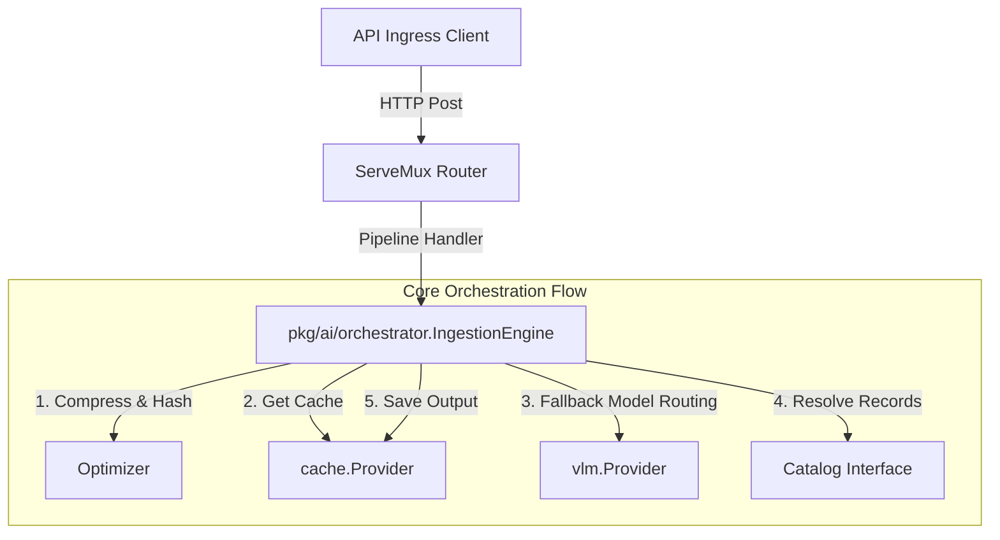

# ADR-001: Declarative AI Pipeline Orchestrator Design

## Context

As BFFX transitions to supporting declarative AI pipelines (e.g., Vision Ingestion, Chatbot Memory), there is a risk of introducing domain-specific or duplicate abstractions within the framework core. For instance, duplicating image compression wrappers, custom model wrappers, or local caching managers under separate package names (like `pkg/ai/caching.go` or `pkg/ai/vlm.go`) creates fragmented maintenance paths and bloats the framework size.

We need a unified, clean orchestrator engine that leverages existing pluggable batteries (VLM, Cache, Worker) instead of reinventing them.

## Decision

1. **Unified Orchestration Engine**: We will establish `pkg/ai/orchestrator` as the primary coordination layer for all AI Pipeline types.
2. **Composition over Duplication**: The orchestrator will not define its own client/model interfaces. Instead, it will directly import and compose:
   - `github.com/hangry-coder/bffx/pkg/batteries/cache` for session storage and cache bypass.
   - `github.com/hangry-coder/bffx/pkg/batteries/vlm` for LLM and VLM model execution and fallbacks.
   - `github.com/hangry-coder/bffx/pkg/worker` for asynchronous pipeline heavy execution queues.
3. **Core Helper Interfaces**:
   - **`Optimizer`**: Handles media optimization (resizing, MIME sniffing, SHA-256 generation) at the ingress boundary.
   - **`PipelineError`**: A standardized framework error interface that translates internal battery/catalog exceptions into client-friendly, retryable HTTP statuses.

## Consequences

- **Pristine Core Abstractions**: Prevents duplicate LLM/VLM adapters or caching engines, keeping code size and complexity down.
- **Robust Model Fallbacks**: If `gemini` returns a quota exhausted error, the orchestrator automatically cascades down the pipeline's declared `model_routing` array (e.g. to `openrouter` or `ollama`).
- **Standardized Error Taxonomy**: Clients receive unified JSON responses (like `vlm_exhausted` or `parse_failed`) matching standard BFFX error signatures.
