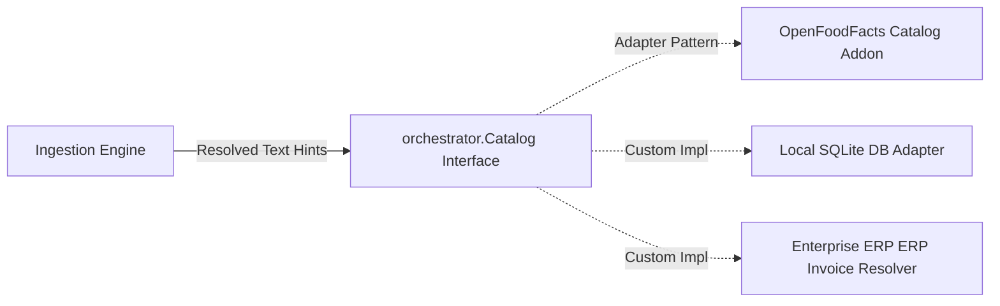

# ADR-002: Catalog Interface, Addon vs Battery Design

## Context

BFFX currently bundles a built-in `batteries.nutrition` mapping directly to the external Open Food Facts service. While this was useful for bootstrapping initial vertical use-cases, embedding domain-specific integrations directly in the framework core violates core modularity principles:
- It bloats the horizontal runtime with third-party web clients (Open Food Facts API, USDA databases).
- It binds the declarative AI engine exclusively to "Nutrition" models, preventing developers from using the same ingestion pipelines for Invoice Scanning, Real-estate OCR, or Receipt Analysis.

We need a clean "Rails-style" extension contract that keeps the core framework generic while allowing developers to plug in domain-specific logic easily.

## Decision

1. **The `Catalog` Extension Contract**: We will declare a generic `Catalog` interface under the core orchestrator package:
   ```go
   type Catalog interface {
       Resolve(ctx context.Context, query string, hints map[string]string) (any, error)
   }
   ```
2. **Catalog Decoupling**: 
   - `batteries.nutrition` will be deprecated and removed from default scaffolding files.
   - The Open Food Facts integration will be relocated from the core framework into **`pkg/addons/catalog/nutrition`** as an optional pluggable domain addon.
3. **Application-Level Injection**: 
   - When scaffolding an AI pipeline (e.g., `bffx generate pipeline ingestion --catalog=openfoodfacts`), the CLI will copy or import the chosen catalog adapter code directly into the developer's project feature folder (`internal/features/<feature>/pipelines/<name>/adapters.go`).
   - The developer can directly edit, mock, or replace this code without needing to modify the underlying framework binary or packages.



## Consequences

- **100% Extensible Domains**: BFFX's declarative AI pipelines can now ingest any structured media (receipts, medical records, ID cards) by simply implementing a standard `Resolve` method.
- **Improved Maintainability**: Changes or outages in domain API endpoints (like Open Food Facts API upgrades) no longer require releasing a new version of the core `bffx` CLI or orchestrator framework.
- **Pristine Core Engine**: The framework orchestrator remains small, light, and focused purely on runtime execution, optimization, caching, and model fallbacks.
