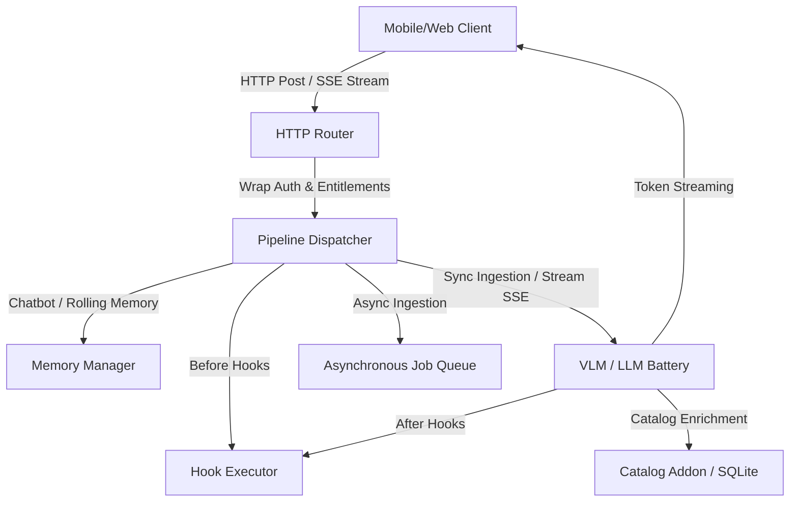

# AI Pipelines: Architecture & Scaffolding

BFFX includes a native **AI Pipelines Orchestrator** designed to declare, sync, and deploy server-side vision ingestion models and conversational agents without writing boilerplates. 

By declaring pipelines in yaml, BFFX automatically sets up HTTP routing, memory sliding-window persistence, token-streaming handlers, entitlement checkpoints, and standard callback hooks.

---

## 1. Pipeline Types

BFFX supports two main types of AI pipelines:

### A. Chatbot (`type: chatbot`)
A conversational agent with built-in rolling-session history. It handles sliding window session memory backed by `cache.Provider` and supports Server-Sent Events (SSE) token streaming.

### B. Ingestion (`type: ingestion`)
A model designed to analyze media assets (images, scans, documents) using VLM batteries, optimize layouts, invoke local/remote catalog integrations, and parse structured output models. Can be executed synchronously or asynchronously via `execution: async`.

---

## 2. Manifest Schema

Pipelines are declared in feature folders (e.g. `internal/features/<feature>/manifests/<name>_pipeline.yaml`):

```yaml
apiVersion: bffx.io/v1alpha1
kind: Pipeline
metadata:
  name: Coach
spec:
  type: chatbot
  execution: sync # or 'async' for heavy ingestion
  route:
    method: POST
    path: /api/v1/coach
    auth: optional # required, optional, none
  settings:
    max_sliding_history: 10
    system_prompt: "You are a professional fitness coach."
  hooks:
    beforePipeline:
      - action: CheckDailyUsage
    afterPipeline:
      - action: SendNotification
```

---

## 3. CLI Developer Commands

### 1. Scaffold a Pipeline
To create a new pipeline manifest along with standard adapters, system prompts, and hook stubs, run:
```bash
bffx generate pipeline <type> --name <Name> --feature <feature> [--catalog=<adapter>]
```
Example:
```bash
bffx generate pipeline ingestion --name Scanner --feature meals --catalog=openfoodfacts
```

### 2. Sync Routes & Codegen
Sync newly declared pipeline routes, generate Flutter REST client definitions, and register catalog adapters in the main orchestrator registry:
```bash
bffx sync
```

---

## 4. Architecture Diagram



---

## 5. Vertical Archetype Pipeline Mapping

Each pre-configured BFFX vertical archetype maps to a default AI pipeline specification out of the box. Below is the mapping from CLI aliases to their generated pipeline kinds:

| Archetype Alias | Pipeline Name | Spec Type | Purpose | Catalog Integration |
|---|---|---|---|---|
| **`superapp`** | `Support` | `chatbot` | Streaming support assistant with SSE rolling window memory. | — |
| **`fintech`** | `ReceiptScan` | `ingestion` | Ingests receipts, scans transactions, and categorizes finance data. | — |
| **`dictation`** | `AudioUpload` | `ingestion` (Interim) | meeting transcript async parser. | — |
| **`subscriptions`** | `InboxParse` | `ingestion` | Parses inbound subscription emails/PDFs. | — |
| **`commerce`** | `ProductScan` | `ingestion` | Parses images of physical goods for catalog matching. | — |
| **`notes`** | `Coach` (Optional) | `chatbot` | Optional chatbot coach integration. | — |

To run the pipeline post-hooks during scaffolding, specify `--pipeline=<type>` on `bffx new` or run the manual generator command.

