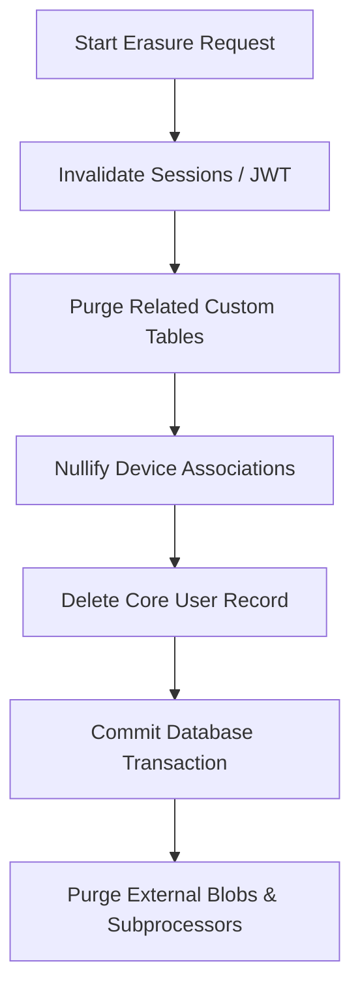

# 🛡️ GDPR User Erasure Playbook ("Right to be Forgotten")

This document provides self-hosted operators and developers using **BFFX** with a clear technical playbook to execute the complete deletion of a user's Personal Identifiable Information (PII) to comply with data subject rights under **GDPR (Article 17)** and **CCPA/CPRA**.

As a fully self-hosted framework, you are the **Data Controller**. The physical erasure of user records across your primary databases, caches, blob storage, background queues, and integrated SaaS subprocessors is your operational responsibility. BFFX provides the batteries and hook patterns to implement this reliably.

---

## 1. Scope of User Deletion

A complete GDPR user erasure request within a default BFFX deployment spans multiple infrastructure tiers. Operators must ensure that all references to the user’s personal identifiers are purged or permanently anonymized.

| Data Tier | Affected Resources | Action Required |
|:---|:---|:---|
| **Primary Database** | `user`, `device`, `refreshtoken`, `userrole` + Custom tables (e.g. `userinterest`, `subscription`) | Delete user row or cascade related tables. Set foreign keys to `NULL` where row retention is needed for statistics. |
| **Authentication Sessions** | JWT IDs (JTIs), active refresh tokens | Revoke refresh tokens, clear active Redis cache keys, and blacklist active sessions. |
| **Blob Storage** | User-uploaded files (profile pictures, PDFs, audio) | Purge raw objects in your S3/R2 bucket or local upload directories. |
| **High-Frequency Caches** | Tagged query caches (`tagcache`) | Invalidate cached profiles and user-specific screens. |
| **Background Queues** | Pending background jobs (Asynq/Redis) | Cancel pending worker executions and purge payload arguments containing PII. |
| **Integrated Subprocessors**| PostHog, Sentry, Stripe, Resend | Trigger deletion requests on external dashboards or via their respective APIs. |

---

## 2. Technical Cascading Pattern (Primary Store)

To prevent orphaned records and structural database errors, always perform database deletions in an ordered, cascading transaction. 

### 2.1 Standard SQL vs Soft Deletion
*   **Soft Deletion (`deleted_at` timestamps)**: Merely setting a `deleted_at` flag does **not** satisfy the GDPR requirement for physical erasure. You must permanently purge the actual row or scrub all PII columns (e.g., set `email = 'scrubbed-user-id@deleted.bffx.dev'`).
*   **Physical Erasure**: Deleting the row entirely is the simplest and safest way to ensure compliance.

### 2.2 Ordered Database Transaction Playbook
When implementing user deletion in your Go hooks, wrap all database operations in a transaction via the `ActionContext.Store` client:



---

## 3. Purging Cache, Sessions, & Blobs

### 3.1 Session & Cache Invalidation
Active authentication tokens must be immediately revoked to block access.
1. **Refresh Tokens**: Delete matching refresh token families from the database.
2. **Token Revocation Cache**: Blacklist the JTI in your Redis JWT denylist if you are utilizing active token revocation checkers.
3. **Tagged Cache Engine**: Invalidate query caches tagged with the user's ID:
   ```go
   // Revoke active cached responses tagged under this user
   ctx.Cache.InvalidatePattern("bffx:user:" + userID + ":*")
   ```

### 3.2 Purging Blob Storage
If your application allows users to upload files via the `blob` battery, you must delete these files from your S3-compatible bucket or local disk:

```go
// Purge user's specific uploads folder in R2/S3
err := ctx.Blob.Delete(r.Context(), "uploads/users/"+userID+"/profile.jpg")
```
> [!TIP]
> **Operational Best Practice**: Structure your upload paths hierarchically using the User ID as a parent directory (e.g., `uploads/users/{user_id}/`). This makes recursive folder deletion simple and auditable.

---

## 4. Subprocessors & Analytics Egress

Once database deletion is completed, trigger API requests to scrub personal data from the subprocessors you have enabled:

1. **PostHog Analytics**: Use PostHog's deletion/suppression API or navigate to the PostHog admin console, search for the User UUID, and trigger a physical profile purge.
2. **Sentry Error Tracking**: Sentry provides a GDPR tool to search and delete all events matching a specific User ID or email.
3. **Stripe Billing**: You must retain tax/billing records for legal/financial audits under local tax laws (GDPR allows this under Article 6(1)(c) - Legal Obligation). However, you should dissociate or delete voluntary metadata on the Stripe Customer object that is no longer required.

---

## 5. Hook and Action Implementation Example

The recommended approach to handle data subject right (DSR) erasures is to declare a standard `/api/v1/users/erase` endpoint driven by a custom Action.

### 5.1 Define the Action Manifest (`bffx/actions/erase_user.yaml`)

Create the following file in your project configuration:

```yaml
# bffx/actions/erase_user.yaml
name: EraseUser
route:
  path: /api/v1/users/erase
  method: POST
  auth: mandatory
spec:
  description: "Triggers complete physical data erasure of the authenticated user to fulfill GDPR right to be forgotten."
```

### 5.2 Implement the Hook Logic (`hooks/erase_user.go`)

When you run `bffx sync`, the compiler stub is created. Implement the hook transactionally like so:

```go
// hooks/erase_user.go
package hooks

import (
	"context"
	"net/http"

	"github.com/hangry-coder/bffx/pkg/api/handlers"
)

func HandleEraseUser(ctx *handlers.ActionContext, w http.ResponseWriter, r *http.Request) {
	// 1. Extract the authenticated User ID from context
	userID := ctx.Claims.Subject
	if userID == "" {
		http.Error(w, "Unauthorized", http.StatusUnauthorized)
		return
	}

	// 2. Perform Cascading Physical Erasure inside a Database Transaction
	err := ctx.Store.Transaction(r.Context(), func(txCtx context.Context) error {
		// A. Delete active refresh tokens
		_, err := ctx.Store.Exec(txCtx, `DELETE FROM "refreshtoken" WHERE user_id = $1`, userID)
		if err != nil {
			return err
		}

		// B. Dissociate devices (anonymizes device records for hardware stats)
		_, err = ctx.Store.Exec(txCtx, `UPDATE "device" SET user_id = NULL WHERE user_id = $1`, userID)
		if err != nil {
			return err
		}

		// C. Purge custom related tables (e.g., custom user interest links in fintech/dictation)
		_, err = ctx.Store.Exec(txCtx, `DELETE FROM "userinterest" WHERE user_id = $1`, userID)
		if err != nil {
			// Fail-safe: some layouts may not have userinterest table
		}

		// D. Physically delete the core User record
		_, err = ctx.Store.Exec(txCtx, `DELETE FROM "user" WHERE id = $1`, userID)
		if err != nil {
			return err
		}

		return nil
	})

	if err != nil {
		ctx.Logger.Error("GDPR User Erasure failed", "user_id", userID, "error", err)
		http.Error(w, "Internal Server Error during data purge", http.StatusInternalServerError)
		return
	}

	// 3. Clear High-Frequency Caches & Session Cache Tags
	if ctx.Cache != nil {
		_ = ctx.Cache.InvalidatePattern("bffx:user:" + userID + ":*")
	}

	// 4. Log the compliance erasure event securely for auditing 
	// (Logs who and when, but excludes PII such as email/name from logs)
	ctx.Logger.Info("GDPR User Erasure executed successfully", "user_id", userID)

	// 5. Respond with 204 No Content
	w.WriteHeader(http.StatusNoContent)
}
```

---

## 6. Audit Logging and Security Best Practices

> [!WARNING]
> **Audit Log PII Leakage**: When logging the completion of an erasure request, **never** include the user's name, raw email address, or other PII in the log message. Log only the system-level User UUID and a generic status code to prevent PII from persisting in secondary log aggregators (e.g., CloudWatch, Axiom) indefinitely.

1. **Self-Hosted Contact Process**: Provide a contact point (e.g., `privacy@yourdomain.com`) in your mobile app settings page to allow users to submit requests.
2. **SLA Deadlines**: GDPR requires you to fulfill erasure requests within **30 days** of receipt. Automated hooks (like the `/api/v1/users/erase` endpoint above) satisfy this immediately and drastically reduce operational overhead.
3. **Guest / Anonymous Accounts**: If your application creates anonymous user records for guest sessions, consider applying a database time-to-live (TTL) sweep job (e.g. via a standard BFFX Cronjob) to automatically delete guest rows that have been inactive for more than 90 days.

---

## 7. Legal Disclaimer

*This document is a technical playbook outlining the system architecture and capabilities of BFFX. It does not constitute legal advice. Developers must consult with their corporate compliance counsel to draft binding privacy policies and verify legal compliance with their regional data protection authorities.*
