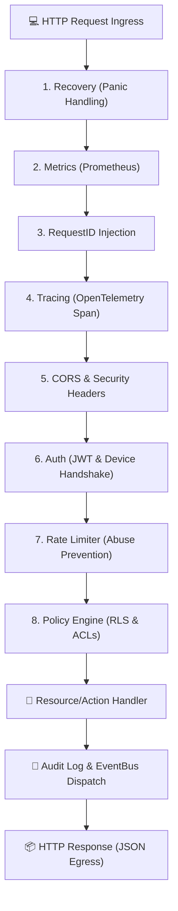

# 🏗️ BFFX Architecture: Resources, Actions & Hooks

BFFX (Backend-for-Frontend X) is a production-grade framework designed to build high-performance mobile and web backends using a **Declarative Manifest** system combined with **Convention-over-Configuration** for logic. 

---

## 1. Design Philosophy

1. **Modular Batteries**: Every non-core feature (Auth, Cache, Analytics, VLM, Nutrition) is implemented as a "Battery" with a clear, decoupled interface.
2. **Schema-First**: The `project.yaml` and resource manifests define the project's resources, actions, and security posture, which the framework uses to dynamically configure routes and validation without boilerplate drift.
3. **Context-First**: Every internal method accepts `context.Context` as its first argument to ensure distributed tracing (OpenTelemetry), cancellation, and deadlines propagate throughout the system.
4. **Security by Default**: Middleware for Authentication, Rate Limiting, CORS, and Security Headers are active by default and fail-closed.

---

## 2. Core System Components

- **The Orchestrator (Go)**: The heart of the framework (`pkg/app`, `pkg/api`), handling HTTP request routing, lifecycles, and service coordination.
- **Manifest Engine (Compiler)**: A declarative system (`pkg/compiler`) that parses YAML manifests and generates optimized Go registries and Python worker skills.
- **Pluggable Storage**: Abstracted store interface (`pkg/storage`) supporting Memory, PostgreSQL, MongoDB, and PocketBase.
- **Unified Messaging**: A Redis-backed EventBus for real-time data streaming and asynchronous job processing.
- **Admin Panel**: A minimal dashboard (`pkg/admin`) for resource management and system monitoring.

---

## 3. The Core Pillars (Declarative Manifests)

All application contracts are centralized in YAML manifests located under the `bffx/` directory:

### 3.1 Resources (The Data)
*   **Definition**: Located in `bffx/resources/*.yaml`.
*   **Role**: Define database schemas, validation constraints, security policies (Row-Level Security), and standard CRUD routes.

### 3.2 Actions (The Custom APIs)
*   **Definition**: Located in `bffx/actions/*.yaml`.
*   **Role**: Define custom state-changing endpoints (mutations) or complex business logic (e.g. `process-payment`, `reset-password`) that do not map to standard CRUD.

### 3.3 Builders (App Structure)
*   **Definition**: Located in `bffx/builders/*.yaml`.
*   **Role**: Optimized "Read-Only" APIs that aggregate data from multiple storage engines or batteries to provide global app configuration, menu structures, and versioning details (e.g., `bootstrap.yaml`).

### 3.4 Screens (UI Views & Navigation)
*   **Definition**: Located in `bffx/screens/*.yaml`.
*   **Role**: The single source of truth for mobile app views. Defines **where** a screen appears in navigation (nav_type, icon, order) and **how** it gets its data.
*   **Dynamic UI**: Flutter apps fetch active screens during boot via `/api/v1/app/bootstrap`, enabling UI updates without a new store release.

---

## 4. Request Lifecycle & Middleware Stack

Every incoming HTTP request flows through a structured, trace-context-propagated middleware chain:

1. **Recovery**: Captures runtime panics and converts them to structured `500 Internal Server Error` responses.
2. **Metrics**: Captures request metrics (durations, status codes) exposed via Prometheus metrics scraper.
3. **RequestID**: Injects unique UUID for log correlation.
4. **Tracing (OTel)**: Propagates trace context across network and databases.
5. **CORS/Security**: Enforces strict browser-facing headers (`HSTS`, `CSP`, `X-Frame-Options`).
6. **Auth**: Decodes JWT/refresh tokens, validates device fingerprints, or provisions anonymous guest sessions (30-day TTL).
7. **Rate Limit**: Automatically blocks rate-abusive IPs.
8. **Policy Engine**: Evaluates declarative row-level policies (e.g. confirming `created_by` matches caller UUID for `owner` rules) before accessing data.

---

## 5. Lifecycle Hooks

Hooks allow developers to inject custom Go code into resource operations. They live in `internal/features/<slice>/hooks/` (v2) or top-level `hooks/` (legacy) and are discovered by `bffx sync`:

| Hook Type | Name Format | When it runs |
| :--- | :--- | :--- |
| **BeforeCreate** | `BeforeCreateUser` | Before saving record (useful for password hashing, default injections). |
| **AfterCreate** | `AfterCreateSubscription` | After saving record (useful for welcome emails, notifications). |
| **BeforeUpdate** | `BeforeUpdateProfile` | Before applying updates. |
| **AfterUpdate** | `AfterUpdateProfile` | After applying updates. |
| **BeforeDelete** | `BeforeDeleteAccount` | Before deleting record. |

**Discovery rules (v0.1.3+):**
- Registered hooks must match `router.HookFunc`: `func(ctx *handlers.ActionContext, payload map[string]any) error`.
- Resource lifecycle hooks use the `BeforeCreate<Resource>` / `AfterCreate<Resource>` naming convention.
- Manifest `hooks:` and pipeline `beforePipeline` / `afterPipeline` entries reference hooks by function name (e.g. `SendOTP`).
- Opt-in: `// @bffx:hook` above a function; opt-out for co-located helpers: `// @bffx:skip-hook`.
- Sync warns when a manifest references a hook name with no registered implementation.

### 5.1 Naming and paylods
- **Typed Payloads**: `bffx sync` generates Go structs under `.bffx/gen/types/*_types.gen.go` so hooks can manipulate fields with strong type safety instead of raw `map[string]any`.
- **Orchestrator Pattern**: When executing multiple sequential tasks (e.g., sending emails and tracking analytics), define a single primary hook handler that delegates to specialized methods, maintaining 100% predictable execution.

---

## 6. Framework Integrations & Capabilities

### 6.1 Communication Hub
Use `ctx.Comm.Alert(userId, title, body)` for unified multi-channel broadcasts. Built-in support exists for:
- Email (Resend/SMTP)
- Push (Firebase Cloud Messaging)
- Direct notifications (WhatsApp, Telegram, Slack, Discord)

### 6.2 Shell vs Core Pattern (Mobile Navigation)
To maximize rendering performance:
- **Bootstrap (The Shell)**: Fetched once on app launch. Contains the navigation skeleton (`Screens`, `Menu`, global config).
- **Builders (The Core)**: Fetched every time a user navigates to a screen, containing only the data needed for that view.
- **Actions**: Handles stateful user interactions (clicks, forms).

### 6.3 Feature Flags & Dynamic UI Targeting
Decouple feature releases from code changes:
- **Pluggable Providers**: Switch between the built-in database-backed provider or third-party solutions (e.g. LaunchDarkly).
- **UI Visibility Maps**: Bind flags directly to screen sections in YAML. The app automatically receives a visibility map on boot, showing or hiding features dynamically.

### 6.4 AI-Native Development (MCP)
BFFX features a Model Context Protocol (MCP) server that lets AI agents securely inspect the project registry, trigger syncs, Dry-Run migrations, and generate client-side boilerplates.

---

## 7. Scaling & Topologies

BFFX supports flexible deployment topologies based on the size of your application:

| Topology Tier | Strategy | Infrastructure | Complexity |
|---|---|---|---|
| **Single Instance** | SQLite primary store + in-memory caches | $5 VPS (DigitalOcean Droplet) | Minimal |
| **Medium Scale** | Postgres store, Redis cache / lock registry | 3-5 load-balanced Docker nodes | Low |
| **High Availability** | Horizontally-scaled Kubernetes cluster | EKS / GKE + RDS PostgreSQL + Elasticache | Medium / High |

---

## 8. Modernization Contracts

For the architecture modernization program (coupling reduction, boundary hardening, minimal packaging), see:

- [Architecture Contracts (Modernization Baseline)](architecture_contracts.md) — index of all contracts and CI gates
- [Build Profile Contract](build_profile_contract.md) — sync output, capabilities, full/minimal vendoring
- [Extension Taxonomy](extension_taxonomy.md) — batteries vs addons vs core
- [Cache Contract](cache_contract.md) — cache semantics and invalidation
- [Observability Contract](observability_contract.md) — logs, metrics, traces naming

**Compiler artifacts:** every successful `bffx sync` writes `.bffx/build-profile.json` alongside `graph.json`, `openapi.json`, and diagnostics. Use `bffx doctor` to detect profile drift.
