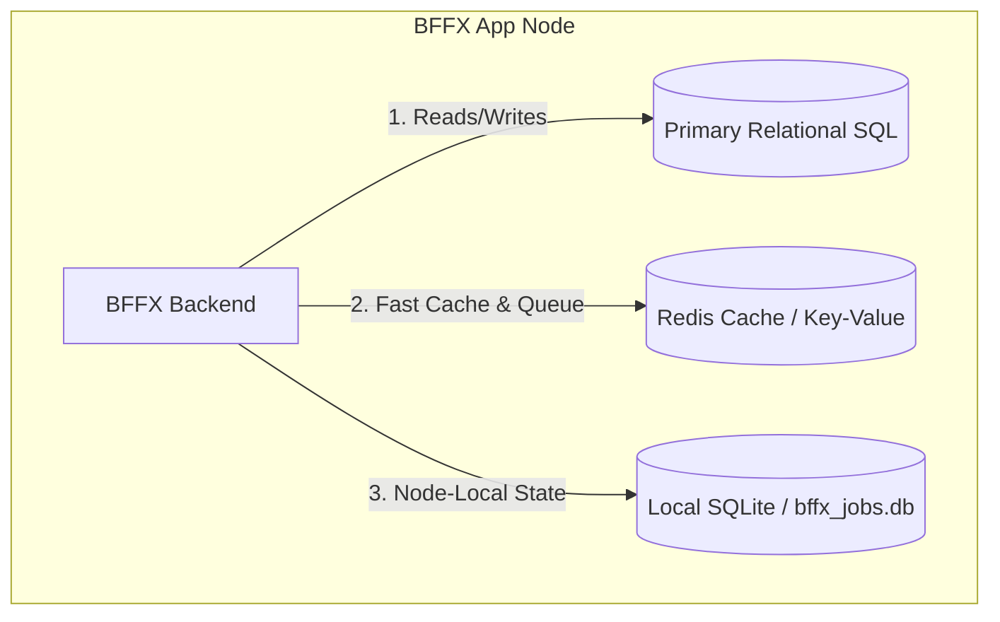
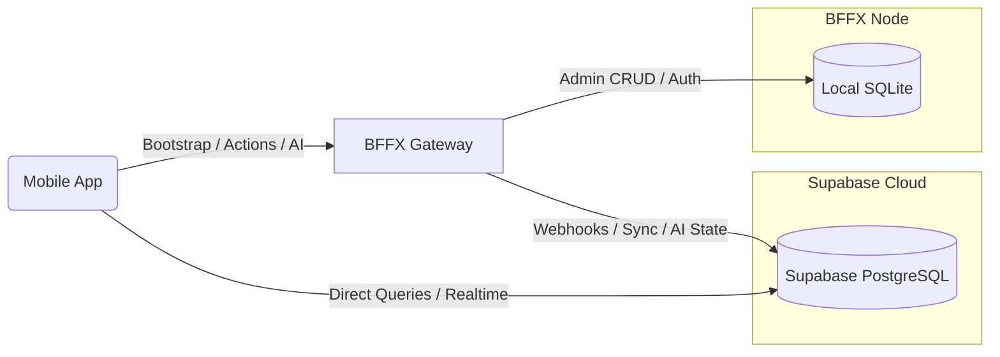

# Database Topology

This document outlines the database architecture, data distribution rules, and multi-database topologies for BFFX-generated backends. It also describes how to partition data if you transition the primary mobile client datastore to an external platform like **Supabase**.

---

## 1. BFFX Default Database Layout

By default, a BFFX backend operates with a primary SQL datastore (SQLite or PostgreSQL) configured in your project manifest, alongside a Redis instance for caching and job queuing.

### Primary SQL Database Structure

The primary database stores three categories of data:

| Category | Typical Tables | Description |
| :--- | :--- | :--- |
| **System & Framework State** | `bffx_admin_users` `bffx_audit_logs` `bffx_feature_flags` | Controls admin portal credentials, audit trails, and runtime feature flag overrides. |
| **User & App Resources** | `users` `subscriptions` `user_stats` `user_interests` | Generated from your custom resource YAML manifests. Holds mobile app business state. |
| **Asynchronous Jobs** | `bffx_jobs` (if SQLite queue is selected) | The persistent backlog of background worker tasks and retry states. |

---

## 2. Maximum Databases in a BFFX Stack

To maintain architectural hygiene and prevent database spaghetti, a single BFFX deployment supports a maximum of **three database tiers** concurrently:

1. **Tier 1: Primary Relational DB (Postgres or SQLite)**
   * **Purpose**: ACID-compliant transactional store for users, resources, and relational entities.
   * **Location**: Remote server (Postgres) or locally attached file (SQLite).
2. **Tier 2: Key-Value / Memory Store (Redis)**
   * **Purpose**: High-throughput caching, rate-limiting counters, token revocation lists, and volatile worker queues.
3. **Tier 3: Local Node-Specific DB (SQLite)**
   * **Purpose**: Local disk-backed file (e.g. `bffx_jobs.db` or `.bffx/local.db`) used strictly for worker queue state and local process locking. Keeps node failures isolated.

---

## 3. Supabase as the Primary Datastore for Mobile Apps

When you choose to rely on **Supabase** as the primary datastore for your mobile clients (allowing the app to read/write directly to Supabase APIs), the BFFX backend shifts to an orchestration, gateway, and admin manager role.

In this architecture, your data is partitioned between the **Remote Supabase PostgreSQL** and a **Local BFFX SQLite Database**:

### Data Partitioning Strategy

To maintain isolation and avoid exposing secure system configuration to the client-facing Supabase instance, use the following distribution:

#### A. Keep in Local BFFX Database (SQLite)
This data should **never** be synchronized to Supabase to prevent privilege escalation and reduce network overhead:
* **Admin Users & Credentials (`bffx_admin_users`)**: Keeps your admin portal authentication fully isolated from public mobile app authentication schemas.
* **BFFX Session State & Local Tokens**: Active sessions for admin panel operators.
* **Feature Flag Overrides (`bffx_feature_flags`)**: Kept local so that the BFFX backend can resolve feature state in-RAM instantly during the client `/bootstrap` request without calling external services.
* **Local Background Job Logs (`bffx_jobs`)**: Retained locally on the server node for diagnostic tracing of async processes (e.g. AI pipeline runners, outbound mail queueing).

#### B. Store in Supabase (Remote PostgreSQL)
This data is exposed to client-side SDKs and synchronized in real-time:
* **App Resources (`users`, `meals`, `water_logs`)**: Allows mobile clients to use Supabase’s offline sync and real-time listeners.
* **AI Credits / Billing Entitlements**: Can be queried by the BFFX backend via Supabase database webhooks or SDK client requests when executing backend-guarded pipelines.

---

## 4. Key Takeaway

By segregating client resource data (in Supabase) from system administrative data (in a local SQLite instance on the BFFX node), you eliminate the risk of client users gaining access to feature flag administration or admin credentials, while keeping the bootstrap payload fast and highly available.
