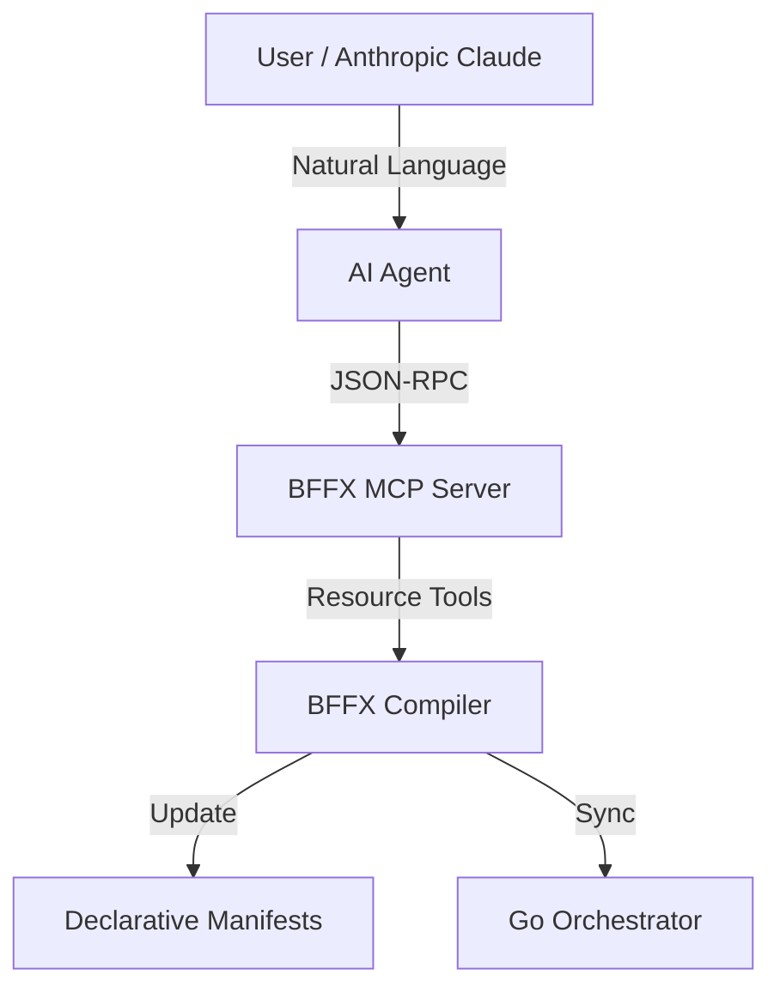
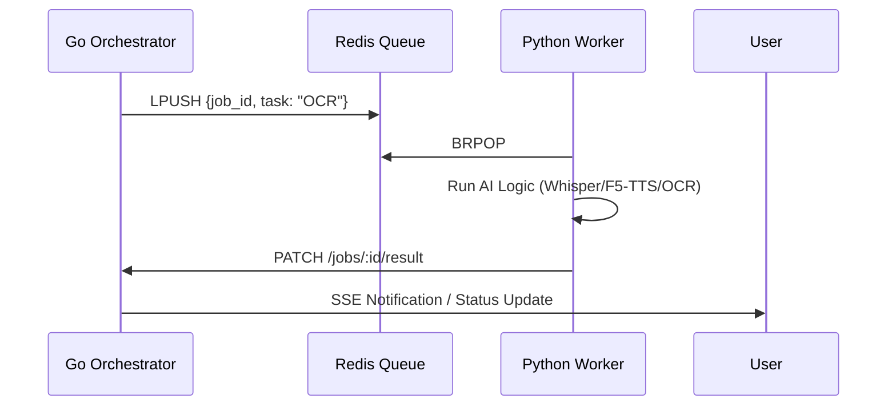

# 🚀 State of the Project: Capabilities, Limitations & Decisions

This document provides a comprehensive, centralized resource outlining what the BFFX framework can do, where its guardrails and architectural limits lie, its subsystem stability metrics, and how it compares against traditional Backend-as-a-Service (BaaS) offerings.

---

## 1. Capabilities Showroom

BFFX is a "Rails-like" backend framework rebuilt for the AI era. It prioritizes **declarative declarations**, **deterministic compilation**, and **AI-native control planes**.

### 1.1 Declarative Resource CRUD
Stop writing boilerplate controllers. Define your resource once in YAML, and BFFX generates the database schema, paginated REST API, and Go/Python interfaces automatically.

```yaml
# bffx/resources/meal.yaml
apiVersion: bffx.io/v1alpha1
kind: Resource
metadata:
  name: Meal
spec:
  fields:
    - { name: name, type: string, required: true }
    - { name: calories, type: int }
    - { name: image, type: file, bucket: uploads }
  policy:
    read: owner
    write: owner
```

**Resulting Endpoints:**
- `GET /api/v1/meals` (Automated pagination)
- `POST /api/v1/meals` (Automated validation)
- `GET /api/v1/meals/:id`
- `DELETE /api/v1/meals/:id`

### 1.2 Data Builders (Mobile-First API)
Don't make 10 requests to populate a single screen. **Builders** aggregate data from multiple resources into a single, optimized JSON payload.

```yaml
# bffx/builders/home.yaml
kind: Builder
metadata:
  name: HomeFeed
spec:
  route: { method: GET, path: /api/v1/home }
  sources: [Profile, DailySummary, RecentMeals]
  output:
    user: Profile
    stats: DailySummary
    feed: RecentMeals
```

### 1.3 AI-Native MCP Hub
BFFX is built with a **Model Context Protocol (MCP)** server at its core. This allows AI agents to "live" inside your project, understanding your architecture and evolving it on your behalf.



**What the AI can do via `bffx mcp serve`:**
- **Inspect**: "Show me the project graph."
- **Generate**: "Add a 'Subscription' resource with a price field."
- **Coordinate**: "Apply these changes and verify the health check."

### 1.4 Async Worker & AI Skills
Heavy tasks like AI image analysis or report generation shouldn't block your API. BFFX uses a **Redis-backed Async Bridge** to dispatch work to a specialized Python worker.



### 1.5 Context-Aware Action Hooks
When you need custom logic (e.g., calling Stripe or an external API), BFFX scaffolds a **Go Hook** with a rich `ActionContext` providing safe access to everything you need.

```go
// hooks/process_payment.go
func HandleProcessPayment(ctx *handlers.ActionContext, w http.ResponseWriter, r *http.Request) {
    // ctx.Store  -> Access the database
    // ctx.Auth   -> Access the current user identity
    // ctx.Queue  -> Dispatch async jobs
    // ctx.Logger -> Structured logging
}
```

### 1.6 Mobile Ecosystem & Addons
BFFX treats mobile features like push notifications as first-class citizens through its **Addon Subsystem**.
- **Unified Identity**: Seamlessly bridge guest users to full accounts with **Account Linking**.
- **Anonymous Sessions**: Issue secure, server-side JWTs for guests with 30-day persistence.
- **Social OAuth**: Google/Apple-style flows are mocked in development via `BFFX_ENABLE_OAUTH=true` for testing.

### 1.7 One-Click Cloud Deployment
Transitioning from `localhost` to production takes one command:
```bash
bffx deploy init
bffx deploy ship
```
After **`bffx deploy init`**, use **`bffx doctor`** and **`bffx update framework`** to validate and refresh the **vendored** framework under **`.bffx/core`**.

### 1.8 Testing & Security Auditing
BFFX brings the elegance of Ruby's RSpec and FactoryBot to Go. 
- **Spec DSL**: Write expressive, behavior-driven tests with `Describe`, `It`, and `Expect`.
- **Data Factories**: Define `Blueprint` manifests to generate complex dummy data for your tests instantly.
- **Security Auditor**: Every test run automatically stress-tests your resource policies to ensure compliance and safety.

### 1.9 Enterprise Feature Flags & Remote Config
Decouple feature deployment from code releases. BFFX provides a unified engine for managing feature toggles and remote configuration:
- **Pluggable Providers**: Seamlessly switch between the local database-backed provider or enterprise systems like **LaunchDarkly**.
- **Dynamic UI Control**: Bind flags to mobile screen sections to hide/show features without an app update.
- **Advanced Targeting**: Implement percentage rollouts, user-group targeting, and environment-specific toggles.

### 1.10 Build Profile & Packaging Modes
Every `bffx sync` emits **`.bffx/build-profile.json`** — the canonical record of enabled capabilities (AI, game, admin, wire, …), router import surfaces, and vendoring intent.

| Mode | `spec.packaging.mode` | Vendoring behavior |
|------|------------------------|-------------------|
| **Full** (default) | omitted or `full` | `bffx update framework --vendor-only` copies all of `pkg/` into `.bffx/core` |
| **Minimal** | `minimal` | Copies runtime `packages` only; excludes CLI tooling (`compiler`, `generator`, `doctor`, …) |

- **New projects:** `bffx new my-app --minimal` scaffolds with `packaging.mode: minimal`.
- **Existing projects:** `bffx migrate packaging apply --to minimal` (with backup + rollback).
- **Validation:** `bffx doctor` checks profile drift, consistency, and migration rollback metadata.

Details: [Build Profile Contract](../core-concepts/build_profile_contract.md).

---

## 2. Subsystem Stability Matrix

Real-time look at the stability of BFFX subsystems:

| Feature Area | 🟢 Stable | 🟠 Beta | 🔴 Exp | ⚪ Planned | Source / Reference |
|:---|:---:|:---:|:---:|:---:|:---|
| **MCP Control Plane** | ✅ | | | | [pkg/mcp](../../pkg/mcp) |
| **Auth (JWT/Guest)** | | ✅ | | | [pkg/auth](../../pkg/auth) |
| **CRUD Engine** | | ✅ | | | [pkg/api/handlers](../../pkg/api/handlers) |
| **Screens & Builders** | | ✅ | | | [pkg/app/builders.go](../../pkg/app/builders.go) |
| **Push (FCM HTTP v1)** | | ✅ | | | [pkg/comm/notifications](../../pkg/comm/notifications) |
| **Email (SMTP / Resend)** | | ✅ | | | [pkg/comm/email](../../pkg/comm/email) |
| **Feature Flags** | | ✅ | | | [pkg/featureflags](../../pkg/featureflags) |
| **Pluggable batteries** | | ✅ | | | [pkg/batteries](../../pkg/batteries) |
| **Prometheus `/metrics`** | | ✅ | | | [pkg/observability](../../pkg/observability) |
| **CLI `routes list` / `dev`** | | ✅ | | | [cmd/bffx/internal/cli](../../cmd/bffx/internal/cli) |
| **Build profile / packaging** | | ✅ | | | [build_profile_contract.md](../core-concepts/build_profile_contract.md) |
| **File Storage** | | ✅ | | | [pkg/storage](../../pkg/storage) |
| **Deploy (Docker/IaC)** | | ✅ | | | [pkg/deploy](../../pkg/deploy) |
| **Billing (Stripe webhooks)**| | ✅ | | | [pkg/addons/billing](../../pkg/addons/billing) |
| **Product analytics (PostHog)**| | ✅ | | | [pkg/comm/analytics](../../pkg/comm/analytics) |
| **Sentry (opt-in build)** | | ✅ | | | [pkg/observability](../../pkg/observability) |
| **AI Pipelines (ingestion / chatbot)** | | ✅ | | | [docs/ai/pipelines.md](../ai/pipelines.md) |
| **Worker (Async)** | | | ✅ | | [pkg/worker](../../pkg/worker) |
| **APNs (Apple Push)** | | | | ✅ | [I2 - Issue #42](#) |
| **Blob presign (S3 / local)**| | ✅ | | | [pkg/storage/blob](../../pkg/storage/blob) |
| **OAuth2 Social (Google)** | | | ✅ | | [router](../../pkg/api/router) |
| **MongoDB `Store` driver** | | | 🔴 | | [mongo.go](../../pkg/storage/mongo.go) (build tag `-tags=experimental_mongo`) |
| **PocketBase `Store` driver**| | | 🔴 | | [pocketbase.go](../../pkg/storage/pocketbase.go) (build tag `-tags=experimental_pocketbase`) |

- 🟢 **Stable**: Production-ready, high test coverage, idiomatic APIs.
- 🟠 **Beta**: Functional and used in pilots; hardening in progress.
- 🔴 **Experimental**: Proof-of-concept; stubbed or partial implementation.
- ⚪ **Planned**: No code landed yet.

---

## 3. Architectural Limitations & Guardrails

BFFX is designed for rapid delivery of data-driven mobile backends. However, like any framework, it has trade-offs:

> Architecture modernization baseline contracts (dependency direction, taxonomy, build profile, cache/observability semantics, and local-first provider adapter rules) are tracked in [`docs/core-concepts/architecture_contracts.md`](../core-concepts/architecture_contracts.md).

### 3.1 Performance & Latency
*   **The Hook Overhead**: Because BFFX allows injecting Go logic at every lifecycle stage, excessive or unoptimized hooks can significantly impact request latency.
*   **Not for HFT**: BFFX is optimized for typical mobile app workloads. It is not designed for High-Frequency Trading or sub-millisecond real-time systems.
*   **Reflective Registry**: The framework uses a registry pattern to resolve resources. Extremely large manifests (1000+ resources) may see increased startup times.

### 3.2 Infrastructure & Scaling
*   **Monolith First**: BFFX is easiest to deploy as a vertical monolith. While it supports horizontal scaling (via Redis and Postgres), it does not yet provide automated cluster-level sharding.
*   **Stateful Components**: Local memory storage (`mode: memory`) is strictly for testing. Production apps **should** use **Postgres**. MongoDB and PocketBase stores are experimental and require explicit build tags.
*   **Redis Dependency**: Asynchronous jobs and real-time events require Redis. Running without Redis limits the framework to synchronous request-response cycles.
*   **Multi-Instance Reconcile**: Postgres uses a blocking `pg_advisory_lock` around legacy `Reconcile()`. SQLite serializes `Reconcile()` with an **in-process `sync.Mutex`**, which prevents races between goroutines in one process but does not coordinate unrelated OS processes opening the same DB file. Set `BFFX_SCHEMA_SINGLETON=false` to disable locking for local experiments. Prefer versioned `bffx migrate` for multi-instance Postgres.
*   **Cache Semantics (Redis-less)**: When running multiple replicas without a shared Redis instance, cache invalidation is local-only, leading to stale data across instances.

### 3.3 Security & Compliance
*   **Row-Level Only**: Current security policies focus on Row-Level Security (RLS). Field-level masking is handled via custom Builders.
*   **Admin LIST**: Collection `GET` routes evaluate the read policy before listing; pair `read: admin` with `write: admin` for fully admin-gated resources.
*   **Rate-Limit Stickiness**: Without Redis, rate limits are tracked per-instance, allowing "bursting" across multiple replicas.
*   **Secure Defaults (Resource Scaffolds)**: Core resource templates default to safe policies. The `User` resource scaffolding requires `write: authenticated`, forcing user signup and creation to pass through dedicated auth routes (e.g. `/auth/signup`) instead of raw public CRUD POSTs. CMS-facing resources like `AppString` and `AppConfig` scaffold with `write: admin` defaults to prevent world-writable configuration injections.

### 3.4 Storage `Store` API & `context.Context`
*   **First-class cancellation**: `pkg/storage.Store` methods take `ctx context.Context` as the first argument. Custom store implementations, hooks, and jobs must thread the same context into `List` / `Get` / `Create` / `Update` / `Delete` / `Query` / `Reconcile` so client disconnects and deadlines cancel underlying SQL or RPC work.
*   **Telemetry split**: When `telemetryStore` is configured, `RouterStore` routes resources marked `telemetry: true` in the manifest to the telemetry backend for **all** CRUD verbs (same context semantics as the primary store). Do not assume only reads are mirrored.
*   **Classifying cancel errors**: Use `storage.ContextError(err)` at boundaries if you need to treat `context.Canceled` / `context.DeadlineExceeded` uniformly.

### 3.5 Optional telemetry and build tags
*   **Sentry Telemetry**: `github.com/getsentry/sentry-go` is built under `-tags=sentry` in `pkg/observability/sentry_sdk.go`. Regular builds skip this to avoid external library dependencies.
*   **Experimental drivers**: Compiled only with `-tags=experimental_mongo` and `-tags=experimental_pocketbase` to avoid shipping incomplete abstractions in production binaries.

---

## 4. BFFX vs BaaS (Backend-as-a-Service) Decision Guide

Choosing the right architectural boundary is critical for long-term velocity. This guide helps you decide when to use a pure BaaS (like Firebase or Supabase), when to use BFFX, and when to use both.

### 4.1 Quick Comparison

| Need | Pure BaaS (Firebase/Supabase) | BFFX |
| :--- | :--- | :--- |
| **Logic Location** | Security Rules / Edge Functions | Idiomatic Go Hooks / Python Skills |
| **Data Shape** | Database-native (Tables/Docs) | Screen-native (Aggregates) |
| **Versioning** | Hard (breaking schema breaks app) | Easy (BFF masks schema changes) |
| **Testing** | Difficult (Rules are hard to unit test) | Easy (Standard Go `_test.go` files) |
| **Vendor Lock** | High (proprietary APIs/Rules) | Low (Standard Go/SQLite/Redis/Docker) |
| **Off-line / Local** | Vendor-dependent | First-class (SQLite + `bffx dev`) |

### 4.2 When to use Pure BaaS
Use **Firebase or Supabase alone** if:
1. **Zero Backend Logic**: Your app is mostly CRUD with simple "owner-only" permissions.
2. **No Custom Validations**: You don't need complex multi-stage validations before writing to the DB.
3. **Prototyping Speed**: You need a working DB in 30 seconds and don't care about the API contract yet.

### 4.3 When to use BFFX
Use **BFFX** if:
1. **Complex Orchestration**: A single screen needs data from multiple sources (DB, Redis, Third-party API).
2. **Domain Integrity**: You want to enforce business logic in a real programming language (Go), not just "Security Rules."
3. **Cross-Platform Consistency**: You have iOS, Android, and Web and want to ensure they all see the same "Screen Data" without duplicating logic.
4. **Performance**: You want to minimize round-trips by fetching everything for a screen in one request.
5. **Ownership**: You want to be able to self-host anywhere without being tied to a vendor's proprietary runtime.

### 4.4 The Hybrid Approach (Recommended)
Most "Super Apps" use both.
- **Plumbing (BaaS)**: Use Supabase for the Postgres DB, or Firebase for FCM (Push Notifications).
- **Brain (BFFX)**: Use BFFX as the gateway. Your Flutter/Swift app talks ONLY to BFFX. BFFX then talks to your DB, Auth, and third-party services.
