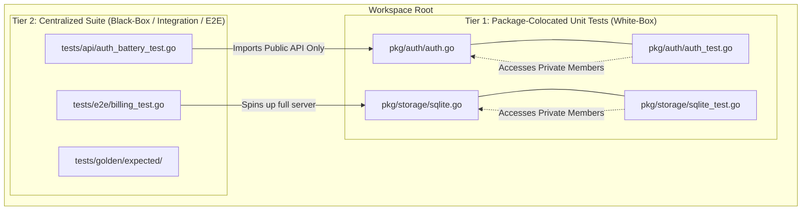

# BFFX Testing Infrastructure & Design Standards

This document establishes the architecture, standards, and guidelines for testing within the BFFX framework. It ensures a consistent, high-performance, and compile-safe test harness for both core contributors and external adopters.

---

## 📐 Two-Tier Testing Topology
BFFX strictly separates tests into two distinct tiers based on their scope, dependencies, and execution needs.

---

## 🧪 Tier 1: Colocated Unit Tests (`pkg/.../*_test.go`)
Unit tests are colocated next to the source code they validate. They are meant for fast, localized, and white-box verification.

### Guidelines
* **Location:** Place `foo_test.go` directly next to `foo.go` in the same directory.
* **Package Name:** Use the same package namespace (e.g. `package auth` in `pkg/auth/`) to allow testing of **unexported (private)** fields, helpers, and internal structs.
* **Scope:** Test a single logical unit of code in isolation. No external database engines, network targets, or API route registries should be spun up.
* **Speed:** Individual tests should execute in under a millisecond. Use short test flags (`go test -short`) to bypass heavier tasks.

### 🚨 Preventing Package Import Cycles
In Go, package `A` cannot import package `B` if package `B` already imports package `A`. 
* If all unit tests were placed in a single root directory (e.g. `/tests/unit`), that package would have to import *every* single module in the repository.
* As soon as one of those modules imported a test helper from that package, it would trigger a compilation failure due to a **cyclic import loop**.
* **Core Rule:** Low-level logic verification *must* reside in colocated unit tests to prevent import loops.

---

## 🔌 Tier 2: Centralized Black-Box Tests (`tests/...`)
High-level tests that validate full scenarios, HTTP routes, code-generation golden outputs, or CLI bindings belong in the centralized `/tests` directory.

### Subdirectories
* **`/tests/api/`:** Validate HTTP route routing, parameters, middleware integration, error handling, and JIT dynamic permissions.
* **`/tests/cli/`:** Validate the CLI commands, input parser arguments, exit codes, and tabular doctor output.
* **`/tests/e2e/`:** Full user flow verification. Covers complex vertical-slice transactions (e.g., signup ➔ verify OTP ➔ purchase premium plan ➔ assert cron cleanup).
* **`/tests/golden/`:** Code-generation template contract assertions. Matches newly compiled files against golden models.

### Guidelines
* **Location:** Centralized at the root in `/tests/...`.
* **Package Name:** Always use `package tests` or `package api_test`. The test files must treat our code as an **external library**, importing only exported (public) API paths.
* **Mock Isolation:** High-level databases (SQLite, telemetry MongoDB) and caching layers should be isolated per test execution. 
* **Short Flag:** Support the `-short` flag to skip cloud/external dependencies during localized developer loops.

---

## 🔋 Production-Aligned Auth Contexts
To mock user sessions reliably without manually injecting arbitrary context values:
1. Use `pkg/testing.NewTestSession(...)` to construct an authentic session identity.
2. Sign a JWT reflecting your active Auth Battery target (e.g., Supabase payload or Clerk metadata).
3. Inject the `Authorization: Bearer <token>` header into your test HTTP request to allow our real production middlewares to verify, decode, and propagate claims safely.
