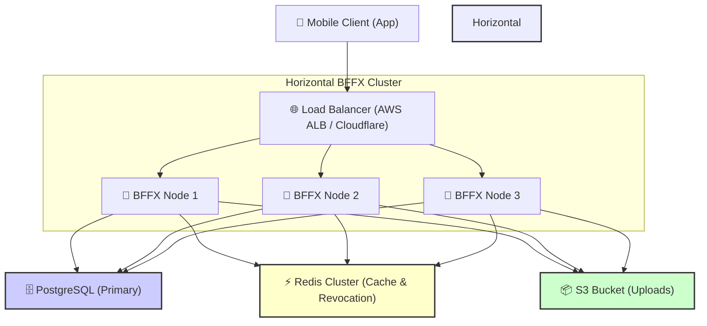

# BFFX High Availability & Scaling Guide

This guide describes how to scale the BFFX framework horizontally across multiple instances (e.g., in a Kubernetes cluster or AWS ECS Service) to support high-throughput, fault-tolerant workloads.

---

## Horizontal Scaling Checklist (HA Requirements)

When scaling BFFX beyond a single process instance, review and check off every item on the following architectural checklist:

- [ ] **1. Upgrade to Distributed Redis Caching**  
  *Why*: In-memory cache engines are isolated per instance. Multi-instance scaling requires shared state. Configure `BFFX_REDIS_URL` to enable the Redis-based distributed caching provider, preventing split-brain cache issues and out-of-sync states.
  
- [ ] **2. Strictly Prohibit SQLite in Production**  
  *Why*: SQLite operates on a single file on disk and does not support distributed concurrent writes from multiple isolated container processes. High-availability requires migrating to PostgreSQL (`BFFX_POSTGRES_URL`) as the primary relational data store.
  
- [ ] **3. Disable Declarative Schema Reconciliation**  
  *Why*: Multi-process race conditions can occur if multiple instances attempt to run DDL schema auto-reconciliation (`Reconcile()`) on boot. In production, turn off auto-sync and instead run versioned CLI migration scripts (`bffx migrate up`) as a pre-boot deployment stage or CI step.
  
- [ ] **4. Configure Symmetric Cryptographic Keys**  
  *Why*: JWT token verification is stateless. All horizontal nodes must be configured with the exact same `BFFX_JWT_SECRET` and `BFFX_ADMIN_SESSION_KEY`. If keys differ, a client will receive `401 Unauthorized` if their request is routed to a node other than the one that generated their token.
  
- [ ] **5. Move Uploads to Shared S3-Compatible Storage**  
  *Why*: Local file uploads (`BFFX_ENABLE_LOCAL_UPLOADS`) write to local disk volumes. When scaled across multiple servers, uploaded files will not be accessible to other nodes. Set up S3-compatible cloud storage (`BFFX_S3_BUCKET`, `BFFX_S3_ACCESS_KEY`, etc.) so presigned uploads are stored in a centralized, shared cloud bucket.
  
- [ ] **6. Enable Trusted Proxy Header Headers**  
  *Why*: Distributed rate-limiting and audit tracking require client IP addresses. Under a load balancer, all traffic originates from the load balancer's IP. Export `BFFX_TRUST_X_FORWARDED_FOR=true` so the rate-limiter and logger extract client IPs from incoming proxy headers.
  
- [ ] **7. Centralize Cron & Worker Executions**  
  *Why*: Background tasks, crons, and action queues must not execute concurrently on multiple nodes. Standardize on the centralized `bffx worker` daemon or leverage external cluster-level orchestrators to isolate background processing to a single instance.
  
- [ ] **8. Maintain Stateless Orchestrator Nodes**  
  *Why*: All horizontal BFFX orchestrator processes must remain stateless. Never store persistent session data or configuration changes directly in the container filesystem. All state must be offloaded to database, cache, or object store backends.
  
- [ ] **9. Implement Horizontal Pod Autoscaling (HPA)**  
  *Why*: Autoscale your container pool horizontally based on performance floors. Set up cluster scaling policies to add nodes when CPU utilization exceeds 70% or when request throughput passes 500 requests per second per node.

---

## Multi-Instance Traffic Layout

The following diagram illustrates how incoming network traffic is routed and processed in a multi-instance, horizontally-scaled BFFX architecture:

