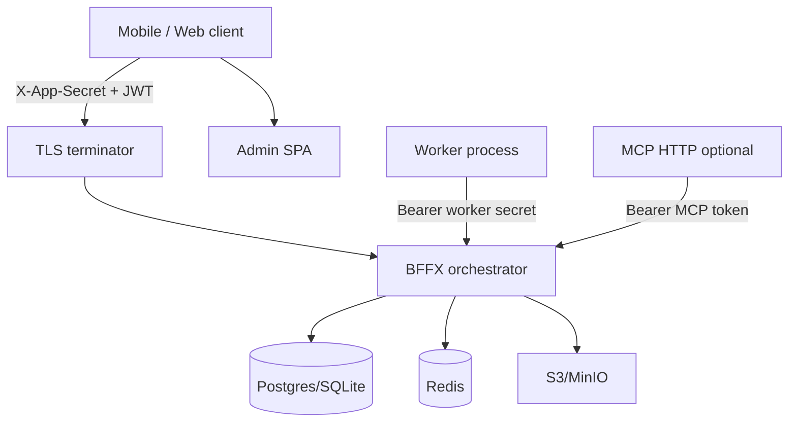

# BFFX Core — Release Readiness Audit

**Repo:** [github.com/hangry-coder/bffx](https://github.com/hangry-coder/bffx)  
**Audited:** 2026-06-20  
**Version context:** `0.1.3-beta` (framework), Go 1.26.4  
**Scope:** Core framework only (`pkg/`, `cmd/bffx/`, `docs/`, CI) — not private pilot apps.

---

## Executive summary

| Audience | Verdict |
|----------|---------|
| **OSS beta (v0.1.x)** | **Ready** with documented caveats — Postgres/SQLite + JWT CRUD path is tested, security-conscious, and honestly documented. |
| **General “production v1”** | **Not ready** — experimental drivers, worker maturity, PR CI gaps, multi-instance ops, and doc maturity contradictions. |
| **Enterprise / HA** | **Not ready** — requires Redis-backed revocation/rate limits, migration discipline, and validated E2E/security gates. |

**One-line:** Ship as **beta framework** for indie mobile backends; do not market as unconditional production without closing the P0/P1 items below.

---

## Scorecard

| Area | Score | Notes |
|------|-------|-------|
| Security | 8/10 | Strong storage/auth patterns; a few endpoint sanitization gaps |
| Data / storage | 8/10 | Parameterized SQL, name validation; experimental Mongo/PocketBase risky |
| Privacy / compliance | 7/10 | GDPR erasure docs + tests exist; operator responsibility for subprocessors |
| Attack surface | 7/10 | Well-layered middleware; worker/OAuth/mock paths need env discipline |
| Scalability | 6/10 | Documented monolith limits; Redis required for multi-replica |
| Maintainability | 7/10 | Good docs honesty; README vs matrix drift |
| Testing / CI | 6/10 | Solid unit + coverage gate; E2E/security not on every PR |
| Operations | 6/10 | `bffx doctor` helps; runbook typos, compose gaps |
| Documentation | 8/10 | `state_of_the_project.md`, security inventory, scaling guide |

---

## Strengths (keep and promote)

1. **SQL injection guardrails** — `validateName` + parameterized queries in `pkg/storage/storage.go`, `postgres.go`.
2. **Production secret fail-fast** — `pkg/app/env.go`, `pkg/app/server.go` reject weak/missing secrets when `BFFX_ENV=production`.
3. **Constant-time comparisons** — `pkg/api/middleware/secrets.go`, Stripe webhook sig (`pkg/addons/billing/stripe_sig.go`), MCP token (`pkg/mcp/http.go`).
4. **JWT revocation fail-closed in production** — `pkg/auth/revocation/redis_checker.go`; doctor enforces Redis when refresh tokens exist.
5. **Response sanitization** — `handlers.SanitizeUser`, `router/sanitize.go` allowlist/denylist for CRUD responses.
6. **Security middleware stack** — CORS fail-closed in prod, ForceSSL/HSTS, security headers, 1MB body limit, 30s timeout (`pkg/api/router/router.go`).
7. **`bffx doctor --env production`** — TLS, SQLite-in-prod, local blob, Redis revocation, placeholder secrets (`pkg/doctor/doctor_security.go`).
8. **CI depth** — unit + coverage gate, race on hot packages, govulncheck, golangci-lint, example sync builds (`/.github/workflows/ci.yml`).
9. **Honest limitations** — `docs/getting-started/state_of_the_project.md`, `docs/guides/security_inventory.md`, `docs/operations/scaling.md`.
10. **Security regression tests** — `tests/api/security_regression_test.go`, `tests/e2e/security_audit_test.go` (nightly/manual).

---

## Critical issues (production blockers)

*None for **beta** scope if limitations are documented.*

For teams claiming **production v1**:

| # | Issue | Path | Impact |
|---|-------|------|--------|
| C1 | Worker job write-back unauthenticated when `BFFX_WORKER_SECRET` empty (non-prod) | `pkg/api/middleware/middleware_cors.go` (`WorkerAuth`) | Job result injection if misconfigured |
| C2 | Experimental Mongo driver lacks validation parity | `pkg/storage/mongo.go` (tag `experimental_mongo`) | Unsafe if enabled in prod |
| C3 | Full E2E + security audit **not in PR CI** | `.github/workflows/ci.yml` | Regressions ship until nightly/manual run |

---

## High priority

| # | Issue | Path | Recommendation |
|---|-------|------|----------------|
| H1 | `/api/v1/me` uses `delete(user, "password")` only | `pkg/api/router/router.go` | Route through `handlers.SanitizeUser` |
| H2 | Per-instance rate limits without Redis | `pkg/api/middleware/middleware_ratelimit.go` | Require Redis for multi-replica; document burst behavior |
| H3 | Credential lockout in-process `sync.Map` | `pkg/api/middleware/auth_credential_limit.go` | Shared store for multi-instance |
| H4 | Scaffolded dev secrets in generated `.env` | `pkg/generator/store_config.go` | Strong warnings + doctor check on first deploy |
| H5 | `bffx new --store mongo\|pocketbase` exposes experimental modes | `cmd/bffx/internal/cli/new.go` | Gate with `--experimental` flag or remove from CLI |
| H6 | README “Production” labels vs beta matrix | `README.md` vs `docs/getting-started/state_of_the_project.md` | Unify maturity labels |
| H7 | Runbook references `BFFX_ADMIN_SECRET` | `docs/operations/runbook.md` | Correct to `BFFX_ADMIN_SESSION_KEY` (`pkg/admin/auth.go`) |
| H8 | Integration tests are connectivity smoke only | `tests/integration/postgres_integration_test.go` | Expand CRUD/auth integration coverage |
| H9 | OAuth routes are mock stubs | `pkg/api/router/router.go` | Never enable `BFFX_ENABLE_OAUTH` in production |

---

## Medium priority

| # | Issue | Path |
|---|-------|------|
| M1 | Redis rate limit is counter/minute, not token bucket | `middleware_ratelimit.go` |
| M2 | Admin login rate limit off unless production or env override | `pkg/admin/auth.go` |
| M3 | `BFFX_APP_SECRET` is embeddable shared secret (obscurity, not user auth) | `middleware_security.go`, mobile codegen |
| M4 | Broad golangci gosec exclusions | `.golangci.yml` |
| M5 | Postgres scaffold `sslmode=disable` | `pkg/generator/store_config.go` |
| M6 | Coverage floors modest (storage 43%) | `tools/coverage_gate.go` |
| M7 | `docker-compose.test.yml` Redis/MinIO unused by tests | `docker-compose.test.yml` |
| M8 | Duplicate CI jobs for example modules | `.github/workflows/ci.yml` |

---

## Low priority

| # | Issue |
|---|-------|
| L1 | Hardcoded API version in hello route (`pkg/api/router/router.go`) |
| L2 | `SECURITY.md` only supports “latest v0.x” — no LTS policy |
| L3 | Go 1.26.4 adoption friction for contributors |

---

## Security attack surface



| Surface | AuthN | Primary risk |
|---------|-------|--------------|
| `/api/v1/auth/*` | Public + credential rate limit | Brute force (per-instance lockout) |
| `/api/v1/*` CRUD | JWT + policy | Policy misconfiguration |
| `/api/v1/me` | JWT | Partial field sanitization |
| `/api/v1/jobs/*` | JWT / worker secret | Misconfigured worker secret |
| `/admin/*` | Signed session cookie | Credential stuffing (rate limit prod-only default) |
| MCP HTTP | `BFFX_MCP_TOKEN` | Token leakage |
| `/metrics`, `/health` | Unauthenticated | Info disclosure (standard) |
| Presign uploads | JWT | TTL abuse if misconfigured |
| Stripe webhooks | HMAC signature | Replay if secret weak |
| Mock OAuth | Env-gated | Must stay disabled in prod |

**SQL injection:** Core paths validate identifiers and bind values. Risk is mainly in **downstream app hooks** that bypass `pkg/storage` — not framework defaults.

---

## Data & storage

| Topic | Status | Guidance |
|-------|--------|----------|
| Postgres | **Supported** | Use versioned `bffx migrate`; avoid multi-instance `Reconcile()` races |
| SQLite | Dev/single-node | Doctor blocks production |
| Mongo / PocketBase | **Experimental** | Build tags only; do not document as production |
| Blob storage | S3/MinIO for HA | Local blob not HA (`docs/operations/scaling.md`) |
| Migrations | Advisory lock on Postgres | `pkg/storage/postgres.go` |
| Dual-write / sharding | Not supported | Monolith-first by design |

---

## Privacy & compliance

| Asset | Location |
|-------|----------|
| GDPR erasure playbook | `docs/compliance/gdpr_erasure.md` |
| Subprocessor inventory | `docs/guides/privacy_and_subprocessors.md` |
| Security inventory | `docs/guides/security_inventory.md` |
| GDPR erasure tests | `tests/api/gdpr_erasure_test.go` |

**Operator responsibility:** Apps built on BFFX must implement app-specific export/delete for all user tables and blobs. Framework provides patterns, not end-user legal compliance by itself.

---

## Scalability

From `docs/operations/scaling.md` and implementation:

1. **SQLite** — single-writer; not for production scale.
2. **Schema reconcile** — use migrations, not reconcile-on-boot, with multiple API replicas.
3. **Cache** — without Redis, tag invalidation is local-only.
4. **Rate limits** — per-instance memory unless Redis configured.
5. **Cron/worker** — must not run on every API replica.
6. **JWT secrets** — symmetric; all nodes need identical signing keys.
7. **Local blob** — not HA; use object storage.

**Horizontal scaling checklist:** Redis (revocation + rate limits + cache), shared Postgres, S3 blobs, single worker/cron leader, TLS at edge, `bffx doctor --env production`.

---

## Testing & CI

| Suite | PR CI | Gap |
|-------|-------|-----|
| Unit + coverage gate | Yes | Floors on 5 packages only |
| Race detector | Partial packages | Not on handlers/admin/mcp |
| Postgres integration | Yes | Ping smoke only |
| Full E2E / security audit | **No** (nightly/manual) | `tests/e2e/security_audit_test.go` |
| Acceptance tests | **No** (nightly/manual) | `tests/acceptance/` |
| Experimental drivers | Build-only | No runtime integration in PR |

**Pre-release manual run:**

```bash
go test ./tests/acceptance/...
go test -tags=integration ./tests/integration/...
go test ./tests/e2e/...
bffx doctor --env production   # in a reference app (e.g. examples/notes)
```

---

## Maintenance debt

| Category | Items |
|----------|-------|
| Doc drift | README vs state_of_the_project; runbook secret name |
| CI redundancy | Duplicate example-module jobs |
| Lint signal | Broad gosec exclusions |
| CLI surface | Experimental stores in `bffx new` |
| Worker maturity | Marked experimental in docs |
| CHANGELOG churn | Unreleased section active |

---

## Pre-release checklist (framework maintainers)

### Before v0.1.x tag

- [ ] Run full E2E + security audit locally; attach summary to release notes
- [ ] Unify README maturity table with `state_of_the_project.md`
- [ ] Fix `/me` sanitization
- [ ] Fix runbook `BFFX_ADMIN_SECRET` → `BFFX_ADMIN_SESSION_KEY`
- [ ] Release notes repeat: worker experimental, Mongo/PocketBase experimental, Redis required for multi-instance

### Before claiming “production framework”

- [ ] E2E + security on every PR (or release branch)
- [ ] Gate experimental CLI store modes
- [ ] Raise coverage floors or expand gated packages
- [ ] Validate multi-instance Redis + migrate playbook in CI
- [ ] Worker auth required in all environments (or fail closed)

---

## Suggested roadmap (framework)

| Phase | Focus |
|-------|-------|
| **R1** | Doc unification, `/me` fix, runbook fix, PR security smoke |
| **R2** | Extract reusable `pkg/ai/safety`, `pkg/insights` registry (from pilot learnings) |
| **R2** | Integration tests beyond ping (auth round-trip, migrate, presign) |
| **R3** | Worker hardening + standard job kinds for ingestion pipelines |
| **R4** | Production maturity review — consider v1.0 criteria document |

---

## References

- `docs/getting-started/state_of_the_project.md`
- `docs/status_matrix.md`
- `docs/guides/security_inventory.md`
- `docs/operations/scaling.md`
- `docs/compliance/gdpr_erasure.md`
- `CHANGELOG.md`
